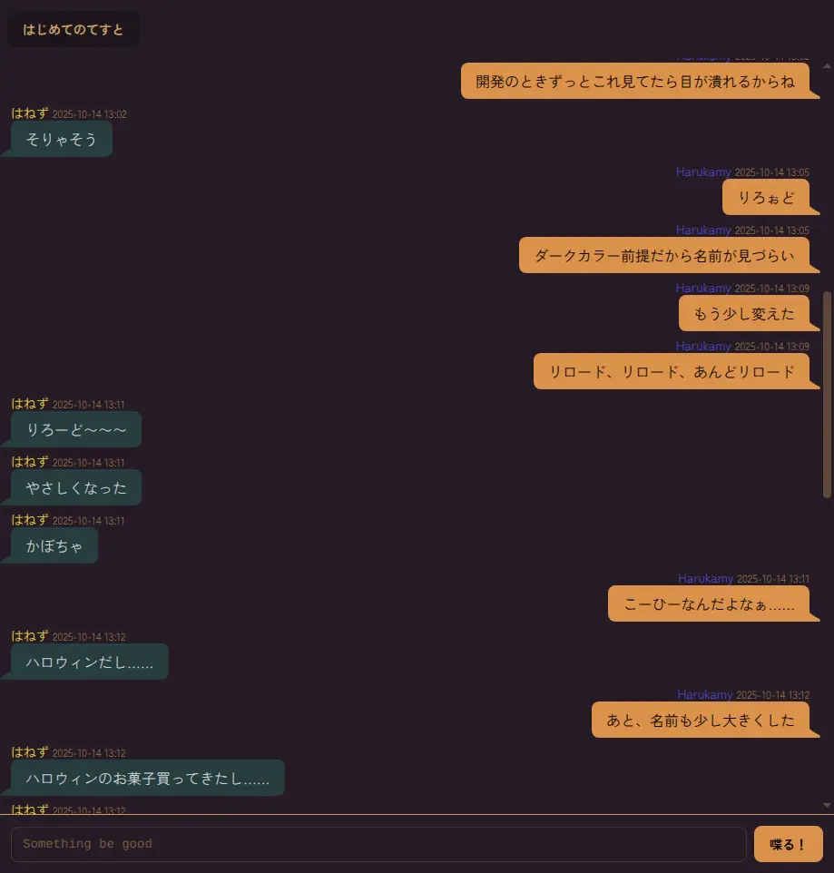
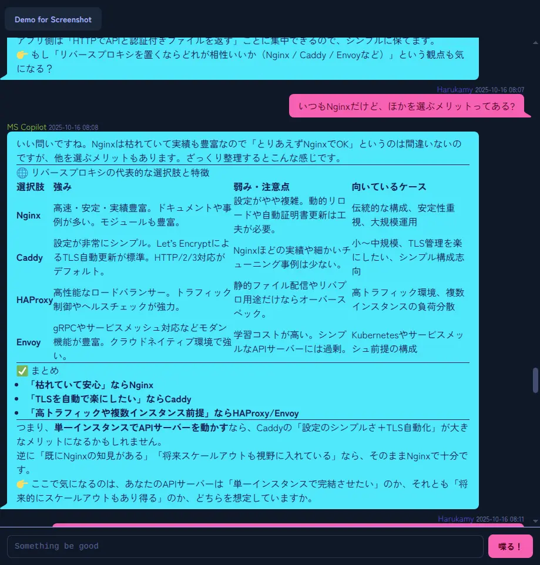

# exolyte

## Synopsis

Minimalist Elixir-based chat system for the web. Built for rapid prototyping and OSS exploration.

## Screenshot






## Dependencies

* Elixir 1.18

## How to use

### Run on local

* Clone git repository `git clone https://github.com/reasonset/exolyte.git`
* `cd exolyte`
* Get dependencies `mix deps.get`
* Compile `mix compile`
* Start server `mix phx.server`

### User and Channel control

If you run the script while the server is running, **you must restart the server after the script completes.**

#### Create User

```
mix run scripts/user_cli.exs put <user_id> <display_name> <password>
```

#### Create Channel

```
mix run scripts/channel_cli.exs create <channel_id> <channel_name>
```

#### Join user to channel

```
mix run scripts/channel_cli.exs adduser <channel_id> <user_id>
```

#### Create user password reset link

```
mix run scripts/user_cli.exs reset <user_id>
```

This script returns reset link id.
Reset URL is `http(s)://<domain.tld>[:<port>]/reset/<reset_link_id>`.

Reset link expires after 24 hours passed.

### Deploy for prod

* Create secret key with `mix phx.gen.secret`
* Clone repository on prod server
* `cd`
* `mix deps.get`
* Configure the `admin.token` settings in `config/prod.secret.exs`
* `SECRET_KEY_BASE=${secret_key} EXOLYTE_HOST=${exolyte_host_name} MIX_ENV=prod mix compile`
* `SECRET_KEY_BASE=${secret_key} EXOLYTE_HOST=${exolyte_host_name} MIX_ENV=prod mix phx.server`

Example of `prod.secret.exs`:

```elixir
import Config

config :exolyte, :admin,
  token: "NfYWkx1p67Df5e5/nC+fabfEWAlqlnhKfufScTykqOaNkBEVut3TEqnuC8sktqjh"
```

When using Nginx or similar as a reverse proxy, you need to configure it to allow WebSocket traffic.

`systemd/exolyte.service` can be used as a Systemd service unit.
Replace the `Environment` line with the appropriate values.

## URLs

* `/mypage` -> User Mypage
* `/login` -> Login page
* `/channel/:channel_id` -> Chat channel

## Live administration

api_cli.exs uses Exolyte's admin API to update settings live. When updating settings this way, no server restart is required.

ali_cli.exs utilizes the server API, so the server must be running to use it.

The admin API requires an Admin token, but api-cli.exs uses the Admin token from config, so it does not need to be specified explicitly.
It is safe to use the admin API through api-cli.exs.

```
mix run scripts/api_cli.exs user_create <user_id> <display_name>
mix run scripts/api_cli.exs user_reset <user_id>
mix run scripts/api_cli.exs channel_create <channel_id> <channel_name>
mix run scripts/api_cli.exs channel_join <channel_id> <user_id>
```
